# HVGSA-PPSN2024
Source code and supplementary material of HVGSA paper for PPSN 2024

Supplementary Materials for PPSN

- [Problem table](#problem-table)
- [Algorithm pseudocode](#algorithm-pseudocode)
- [ZDT objective spaces](#zdt-objective-space)
- [ZDT HV convergence graphs](#zdt-hypervolume-plot)
- [DTLZ objective spaces](#dtlz-objective-space)
- [DTLZ HV convergence graphs](#dtlz-hypervolume-plot)
- [IDTLZ HV convergence graphs](#idtlz-hypervolume-plot)
- [WFG HV convergence graphs](#wfg-hypervolume-plot)
- [Tables](#tables)

# Usage (How to replicate our data)

Preliminary step: 

Download [PlatEMO](https://github.com/BIMK/PlatEMO) and refer to their documentations on how to use this platform.

You only need one set of [stk_*.m](https://stk-kriging.github.io/release/latest/doc/html/) files in your entire project. They are placed within the same directories as the files that use them.

## HVGSA

Place the `HVGSA` directory under ./PlatEMO/Algorithms/Multi-objective optimization. Then, you can use platemo() and see our algorithm within the algorithm list.

## SMS-EMOA

Replace the `SMS-EMOA` directory inside ./PlatEMO/Algorithms/Multi-objective optimization with our `SMS-EMOA`. We used faster HV computation using the WFG algorithms from STK toolbox.

## Metrics

Replace the `HV.m` inside ./PlatEMO/Metrics with our `HV.m`. We used faster HV computation using the WFG algorithms from STK toolbox.

## ZDT

The ZDT4C problem is located here. It belongs in ./PlatEMO/Problems/Multi-objective optimization/ZDT

## Utility

Locate `visualizeHV.m` and `visualizeObj.m` within `Utility` directory and place both files under ./PlatEMO. Then, after collecting data from the `Experiment Module` within the PlatEMO GUI, specify the data directory and problems you want to visualize within `visualizeHV.m` and `visualizeObj.m`, and run the module.

# Supplementary Material for PPSN 2024

## Problem table

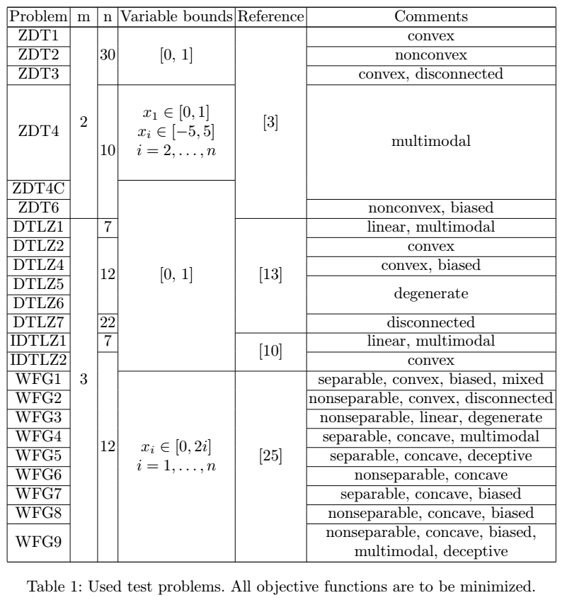

## Algorithm pseudocode

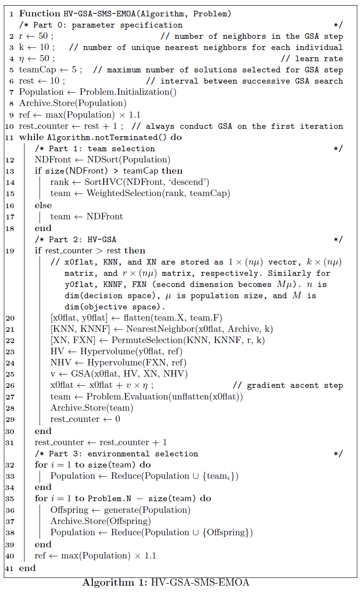

## ZDT objective space

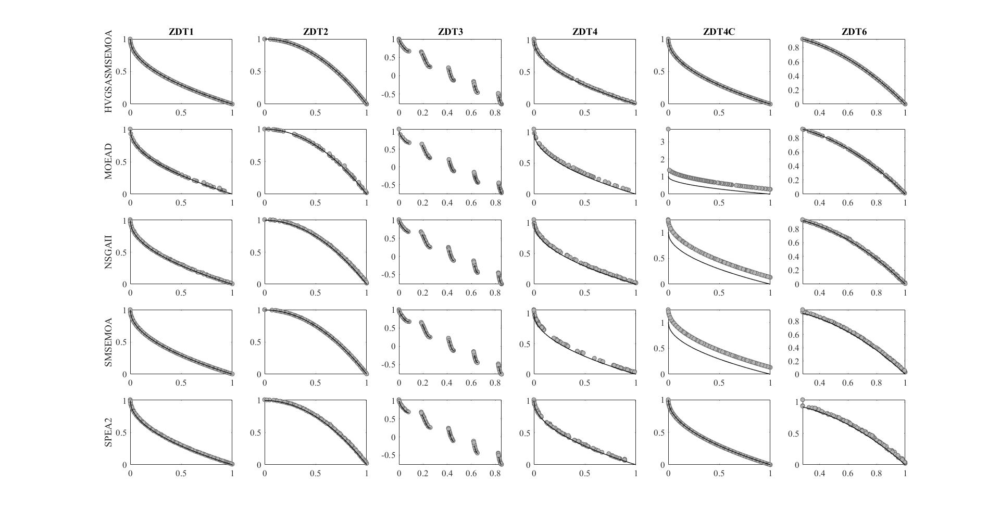

## ZDT hypervolume plot

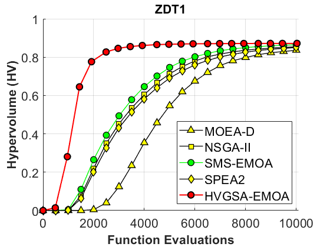

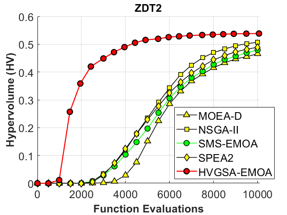

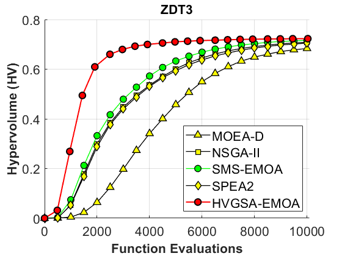

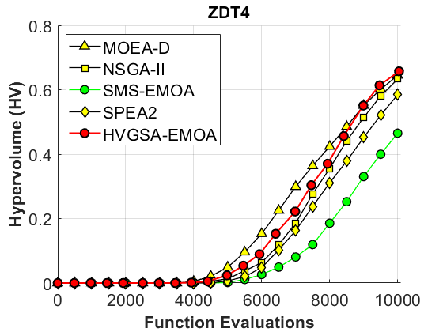

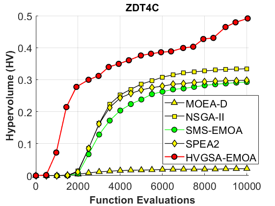

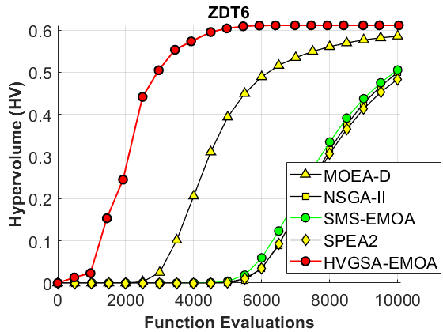

## DTLZ objective space

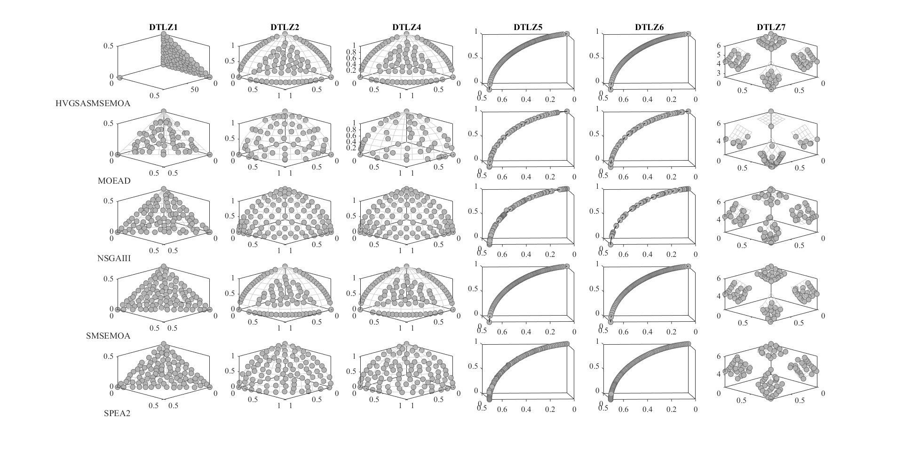

Notice how for DTLZ1, our algorithm has 1 point far from the pareto front. In our paper, specifically at the end of Section 3.3, we mentioned an implementation issue where duplicated points are generated and kept in the population. This causes hypervolume contribution to be 0 for all the duplicated points. Yet, in the next generation, just before the environmental selection, if the HVGSA step is executed, some of the points might be steered into infeasible regions and fixed to be very far from the Pareto front. If those points also happen to be nondominated (which is often the case in higher-dimensional spaces), they will have a larger hypervolume contribution than 0, and as a result outlive the duplicated solutions. This is the behavior observed in DTLZ1. When we introduce adaptive step size control and alternative dominance relations, we believe this issue will be resolved. 

## DTLZ hypervolume plot

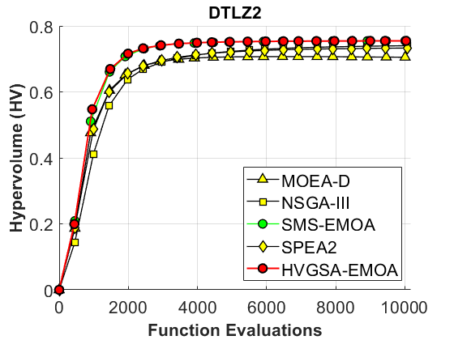

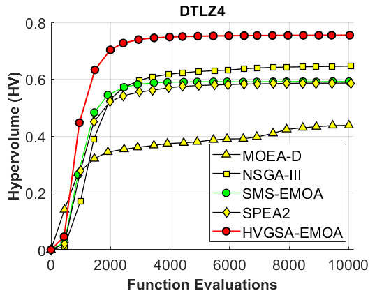

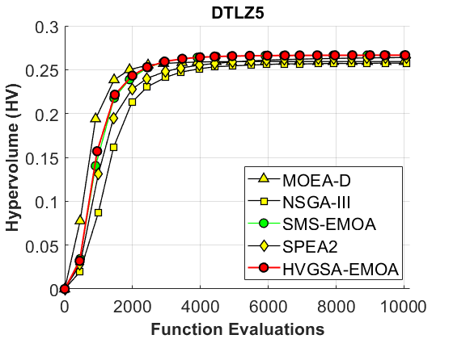

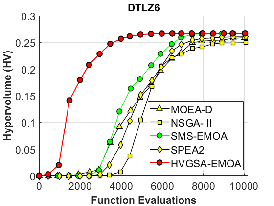

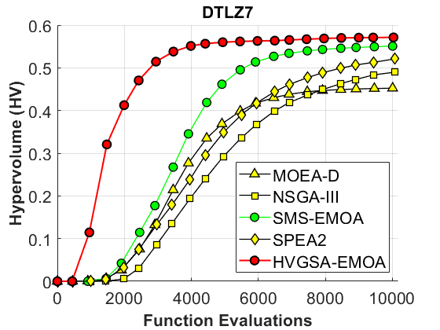

## IDTLZ hypervolume plot

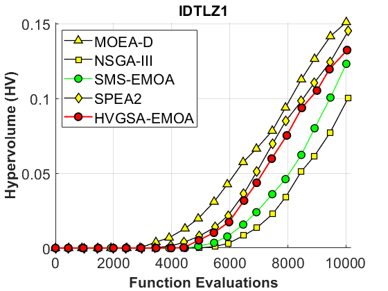

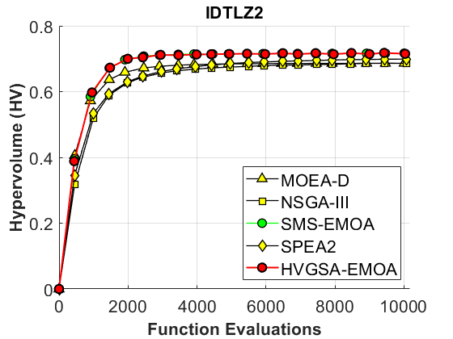

## WFG hypervolume plot

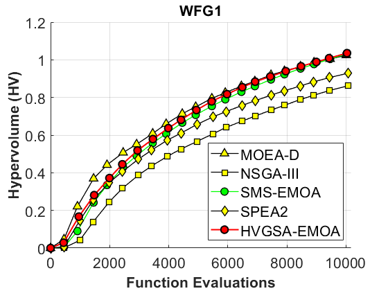

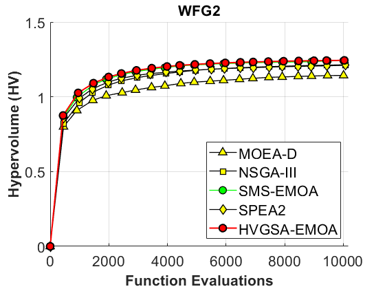

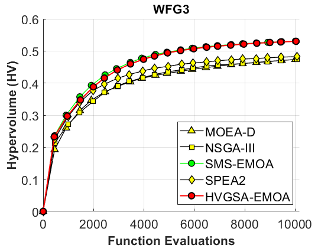

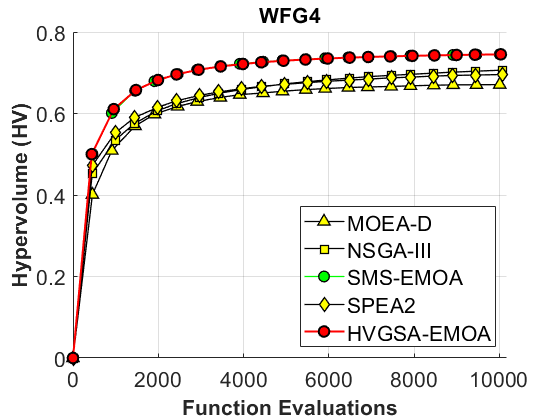

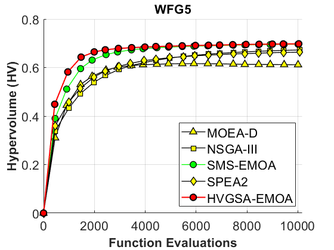

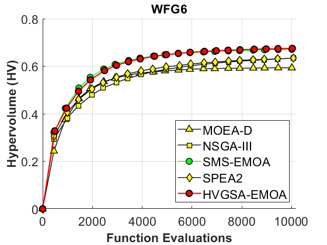

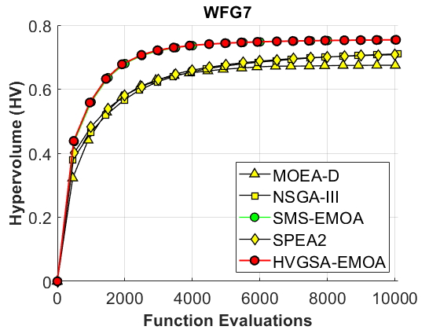

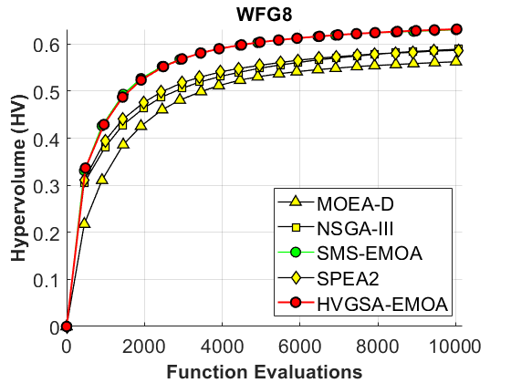

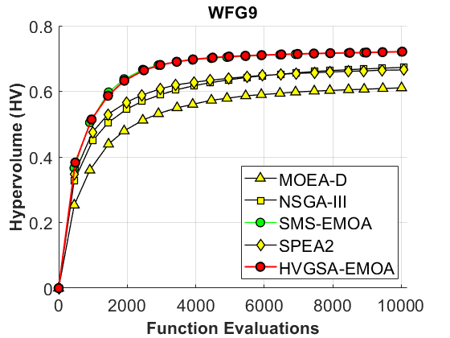

## Tables

### ZDT

|Problem|M  |D  |NSGAII               |MOEAD                |SPEA2                |SMSEMOA              |HVGSASMSEMOA       |
|-------|---|---|---------------------|---------------------|---------------------|---------------------|-------------------|
|ZDT1   |2  |30 |8.5413e-1 (3.54e-3) -|8.3604e-1 (1.38e-2) -|8.4991e-1 (4.61e-3) -|8.6440e-1 (2.30e-3) -|**8.7176e-1 (8.94e-4)**|
|ZDT2   |2  |30 |5.0740e-1 (3.03e-2) -|4.6550e-1 (7.40e-2) -|4.8923e-1 (6.02e-2) -|4.7942e-1 (7.21e-2) -|**5.3836e-1 (1.16e-3)**|
|ZDT3   |2  |30 |7.0851e-1 (6.63e-3) -|6.8321e-1 (2.07e-2) -|7.0463e-1 (6.96e-3) -|7.1628e-1 (8.09e-3) -|**7.2276e-1 (7.90e-3)**|
|ZDT4   |2  |10 |6.3339e-1 (1.59e-1) =|6.4461e-1 (9.88e-2) =|5.8441e-1 (1.86e-1) -|4.6501e-1 (2.15e-1) -|**6.5725e-1 (1.57e-1)**|
|ZDT4C  |2  |10 |3.3407e-1 (2.23e-1) -|2.1720e-2 (7.93e-2) -|2.9770e-1 (2.12e-1) -|2.9267e-1 (2.03e-1) -|**4.9145e-1 (3.40e-1)**|
|ZDT6   |2  |10 |4.9964e-1 (5.78e-2) -|5.8577e-1 (7.04e-3) -|4.8347e-1 (5.33e-2) -|5.0550e-1 (4.29e-2) -|**6.1144e-1 (2.99e-5)**|
|+/-/=  |   |   |0/5/1                |0/5/1                |0/6/0                |0/6/0                |                   |

### DTLZ

|Problem|M  |D  |NSGAIII              |MOEAD                |SPEA2                |SMSEMOA              |HVGSASMSEMOA       |
|-------|---|---|---------------------|---------------------|---------------------|---------------------|-------------------|
|DTLZ1  |3  |7  |6.8257e-1 (4.19e-1) =|**7.1124e-1 (4.02e-1) =**|6.5528e-1 (4.47e-1) =|6.4943e-1 (4.49e-1) =|6.5869e-1 (4.56e-1)|
|DTLZ2  |3  |12 |7.3996e-1 (9.29e-4) -|7.0500e-1 (2.28e-3) -|7.3292e-1 (2.20e-3) -|7.5473e-1 (1.14e-4) =|**7.5474e-1 (1.41e-4)**|
|DTLZ4  |3  |12 |6.4601e-1 (1.64e-1) -|4.3733e-1 (2.27e-1) -|5.8635e-1 (1.77e-1) -|5.9196e-1 (1.77e-1) -|**7.5468e-1 (1.59e-4)**|
|DTLZ5  |3  |12 |2.5744e-1 (1.42e-3) -|2.5928e-1 (1.44e-4) -|2.6387e-1 (4.44e-4) -|2.6651e-1 (2.64e-5) =|**2.6652e-1 (2.69e-5)**|
|DTLZ6  |3  |12 |2.4957e-1 (3.61e-2) -|2.5857e-1 (8.85e-3) -|2.6055e-1 (3.76e-2) -|2.6658e-1 (8.05e-5) -|**2.6660e-1 (9.89e-6)**|
|DTLZ7  |3  |22 |4.8990e-1 (1.92e-2) -|4.5235e-1 (1.10e-2) -|5.2100e-1 (7.99e-3) -|5.5082e-1 (4.42e-2) -|**5.7125e-1 (1.96e-2)**|
|+/-/=  |   |   |0/5/1                |0/5/1                |0/5/1                |0/3/3                |                   |

### IDTLZ

|Problem|M  |D  |NSGAIII              |MOEAD                |SPEA2                |SMSEMOA              |HVGSASMSEMOA       |
|-------|---|---|---------------------|---------------------|---------------------|---------------------|-------------------|
|IDTLZ1 |3  |7  |1.0054e-1 (9.70e-2) =|**1.5104e-1 (8.97e-2) =**|1.4528e-1 (1.12e-1) =|1.2318e-1 (1.13e-1) =|1.3235e-1 (1.16e-1)|
|IDTLZ2 |3  |12 |6.8599e-1 (4.10e-3) -|6.8611e-1 (1.03e-3) -|6.9895e-1 (2.08e-3) -|**7.1662e-1 (1.72e-3) +**|7.1493e-1 (3.00e-3)|
|+/-/=  |   |   |0/1/1                |0/1/1                |0/1/1                |1/0/1                |                   |

### WFG

|Problem|M  |D  |NSGAIII              |MOEAD                |SPEA2                |SMSEMOA              |HVGSASMSEMOA       |
|-------|---|---|---------------------|---------------------|---------------------|---------------------|-------------------|
|WFG1   |3  |12 |8.6217e-1 (4.90e-2) -|1.0242e+0 (6.82e-2) =|9.2936e-1 (6.99e-2) -|1.0299e+0 (3.40e-2) =|**1.0354e+0 (4.76e-2)**|
|WFG2   |3  |12 |1.2140e+0 (6.22e-3) -|1.1428e+0 (3.24e-2) -|1.2107e+0 (2.89e-2) -|1.2417e+0 (1.99e-2) =|**1.2437e+0 (4.02e-3)**|
|WFG3   |3  |12 |4.7365e-1 (1.09e-2) -|4.7338e-1 (2.10e-2) -|4.8239e-1 (9.67e-3) -|**5.3072e-1 (6.45e-3) =**|5.3010e-1 (5.91e-3)|
|WFG4   |3  |12 |7.0645e-1 (4.75e-3) -|6.7092e-1 (6.17e-3) -|6.9563e-1 (5.19e-3) -|**7.4539e-1 (1.92e-3) =**|7.4516e-1 (1.69e-3)|
|WFG5   |3  |12 |6.7248e-1 (4.89e-3) -|6.1147e-1 (5.37e-3) -|6.6364e-1 (6.10e-3) -|6.9648e-1 (4.28e-3) -|**6.9780e-1 (3.49e-3)**|
|WFG6   |3  |12 |6.3361e-1 (1.78e-2) -|5.9302e-1 (3.12e-2) -|6.3351e-1 (1.97e-2) -|6.7112e-1 (1.74e-2) =|**6.7504e-1 (2.03e-2)**|
|WFG7   |3  |12 |7.1051e-1 (3.67e-3) -|6.7461e-1 (7.43e-3) -|7.0756e-1 (4.04e-3) -|7.5404e-1 (7.91e-4) =|**7.5413e-1 (6.10e-4)**|
|WFG8   |3  |12 |5.8913e-1 (5.21e-3) -|5.6240e-1 (1.25e-2) -|5.8674e-1 (5.14e-3) -|6.3020e-1 (3.58e-3) =|**6.3160e-1 (3.16e-3)**|
|WFG9   |3  |12 |6.7323e-1 (1.00e-2) -|6.1065e-1 (4.23e-2) -|6.6516e-1 (9.06e-3) -|7.2037e-1 (4.17e-3) -|**7.2101e-1 (1.96e-2)**|
|+/-/=  |   |   |0/9/0                |0/8/1                |0/9/0                |0/2/7                |                   |

