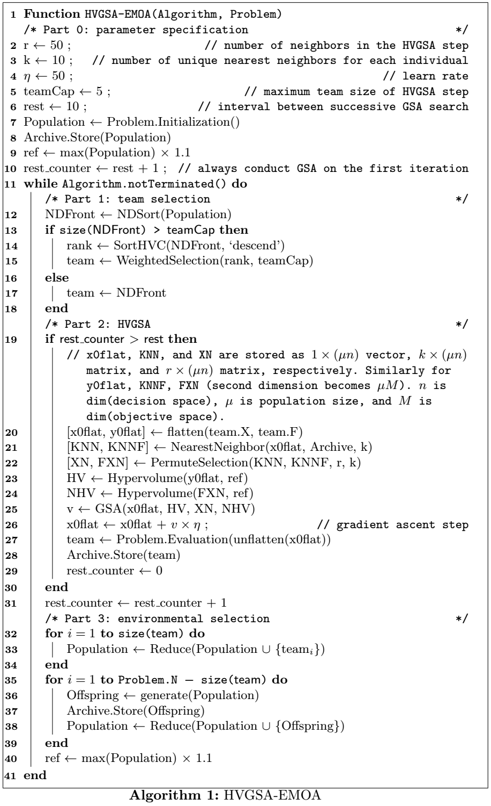
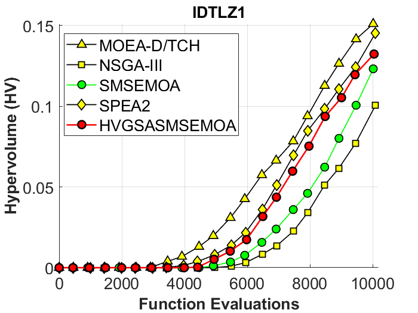

# HVGSA-PPSN2024
Source code and supplementary material of HVGSA paper for PPSN 2024

Supplementary Materials for PPSN

- [Algorithm pseudocode](#algorithm-pseudocode)
- [ZDT objective spaces](#zdt-objective-space)
- [ZDT HV convergence graphs](#zdt-hypervolume-plot)
- [DTLZ objective spaces](#dtlz-objective-space)
- [DTLZ HV convergence graphs](#dtlz-hypervolume-plot)
- [IDTLZ HV convergence graphs](#idtlz-hypervolume-plot)
- [WFG HV convergence graphs](#wfg-hypervolume-plot)

# Usage (How to replicate our data)

Preliminary step: 

Download [PlatEMO](https://github.com/BIMK/PlatEMO) and refer to their documentations on how to use this platform.

## HVGSA

Place the `HVGSA` directory under ./PlatEMO/Algorithms/Multi-objective optimization. Then, you can use platemo() and see our algorithm within the algorithm list.

## Utility

Locate `visualizeHV.m` and `visualizeObj.m` within `Utility` directory and place both files under ./PlatEMO. Then, after collecting data from the `Experiment Module` within the PlatEMO GUI, specify the data directory and problems you want to visualize within `visualizeHV.m` and `visualizeObj.m`, and run the module.

# Supplementary Material for PPSN 2024

## Algorithm pseudocode

## ZDT objective space

## ZDT hypervolume plot

## DTLZ objective space

## DTLZ hypervolume plot

## IDTLZ hypervolume plot

## WFG hypervolume plot

